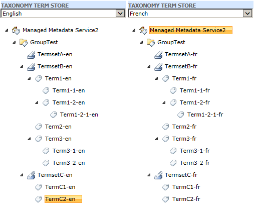

# SPU

- [Installation](#user-content-installation)
- [Usage](#user-content-usage)
- [Termstore](#user-content-termstore)
  - [Exportation](#user-content-exportation)
  - [Importation](#user-content-importation)
- [Solutions](#user-content-solutions)
  - [Exportation](#user-content-exportation-1)
  - [Importation](#user-content-importation-1)

# Installation

Automatic installation (requires an internet connection)

```PowerShell
iex (New-Object System.Net.WebClient).DownloadString("https://raw.github.com/maximebedard/SPU/master/install.ps1")
```

Manual installation

1. Download the latest version [here](https://github.com/maximebedard/SPU/archive/master.zip)
2. Extract the content to ~\Documents\WindowsPowerShell\Modules\SPU

# Usage

To start using the cmdlets :

```PowerShell
Import-Module SPU 
```

To see all the available commands :

```PowerShell
Get-Command -Module SPU
```

# Termstore

This section explains how to export an import Taxonomy Groups contained within SharePoint Managed Metadata Service.
The following structure will be used as an example :


## Exportation

```PowerShell
# Exporting GroupTest Taxonomy Group
Get-SPUTermstore "Managed Metadata Service2" | 
  Export-SPUTaxonomyGroup -LiteralPath C:\out.xml -GroupName "GroupTest"

# If the taxonomy group was in the default termstore, the following can be used
Get-SPUTermstore | 
  Export-SPUTaxonomyGroup -LiteralPath C:\out.xml -GroupName "GroupTest"

# For more info
Get-Help Export-SPUTaxonomyGroup

```

The following xml is generated at C:\out.xml


```Xml
<Groups>
  <Group Name="GroupTest" Description="">
    <TermSets>
      <TermSet ID="b64862b8-fbfa-4989-bd92-1c72d6deafca">
        <Name LCID="1033">TermsetA-en</Name>
        <Description LCID="1033" />
        <Name LCID="1036">TermsetA-fr</Name>
        <Description LCID="1036" />
        <Terms />
      </TermSet>
      <TermSet ID="9f38e895-da6f-403e-a18a-1545a07937f7">
        <Name LCID="1033">TermsetB-en</Name>
        <Description LCID="1033" />
        <Name LCID="1036">TermsetB-fr</Name>
        <Description LCID="1036" />
        <Terms>
          <Term ID="c8a8a715-f7ec-4257-89a6-31dfee9bd0ec">
            <Labels>
              <Label LCID="1033" IsDefaultForLanguage="True">Term1-en</Label>
              <Label LCID="1036" IsDefaultForLanguage="True">Term1-fr</Label>
            </Labels>
            <Terms>
              <Term ID="7ac37189-f951-4593-b05d-320d645bc64e">
                <Labels>
                  <Label LCID="1033" IsDefaultForLanguage="True">Term1-1-en</Label>
                  <Label LCID="1036" IsDefaultForLanguage="True">Term1-1-fr</Label>
                </Labels>
                <Terms />
              </Term>
              <Term ID="e77695fa-945e-4fa6-8128-6533afbd57d5">
                <Labels>
                  <Label LCID="1033" IsDefaultForLanguage="True">Term1-2-en</Label>
                  <Label LCID="1036" IsDefaultForLanguage="True">Term1-2-fr</Label>
                </Labels>
                <Terms>
                  <Term ID="395a0d1f-350a-404e-9c4e-8f2169eadf1f">
                    <Labels>
                      <Label LCID="1033" IsDefaultForLanguage="True">Term1-2-1-en</Label>
                      <Label LCID="1036" IsDefaultForLanguage="True">Term1-2-1-fr</Label>
                    </Labels>
                    <Terms />
                  </Term>
                </Terms>
              </Term>
            </Terms>
          </Term>
          <Term ID="eee15d9a-bb53-4002-b176-d561a2062f70">
            <Labels>
              <Label LCID="1033" IsDefaultForLanguage="True">Term2-en</Label>
              <Label LCID="1036" IsDefaultForLanguage="True">Term2-fr</Label>
            </Labels>
            <Terms />
          </Term>
          <Term ID="0b133c81-e575-41c4-a355-e6fd5d5a5ebe">
            <Labels>
              <Label LCID="1033" IsDefaultForLanguage="True">Term3-en</Label>
              <Label LCID="1036" IsDefaultForLanguage="True">Term3-fr</Label>
            </Labels>
            <Terms>
              <Term ID="667bce45-dd0f-4cfd-818b-0d08a5d6d794">
                <Labels>
                  <Label LCID="1033" IsDefaultForLanguage="True">Term3-1-en</Label>
                  <Label LCID="1036" IsDefaultForLanguage="True">Term3-1-fr</Label>
                </Labels>
                <Terms />
              </Term>
              <Term ID="b69ca509-761e-4c58-838f-ab6983011a3d">
                <Labels>
                  <Label LCID="1033" IsDefaultForLanguage="True">Term3-2-en</Label>
                  <Label LCID="1036" IsDefaultForLanguage="True">Term3-2-fr</Label>
                </Labels>
                <Terms />
              </Term>
            </Terms>
          </Term>
        </Terms>
      </TermSet>
      <TermSet ID="c3d981f2-67cc-44d6-9507-a8a739cff950">
        <Name LCID="1033">TermsetC-en</Name>
        <Description LCID="1033" />
        <Name LCID="1036">TermsetC-fr</Name>
        <Description LCID="1036" />
        <Terms>
          <Term ID="9881b7d3-15eb-4efe-bb0a-27b30abe0fc3">
            <Labels>
              <Label LCID="1033" IsDefaultForLanguage="True">TermC1-en</Label>
              <Label LCID="1036" IsDefaultForLanguage="True">TermC1-fr</Label>
            </Labels>
            <Terms />
          </Term>
          <Term ID="424a5927-348a-44b6-ae09-39e6bad97ffa">
            <Labels>
              <Label LCID="1033" IsDefaultForLanguage="True">TermC2-en</Label>
              <Label LCID="1036" IsDefaultForLanguage="True">TermC2-fr</Label>
            </Labels>
            <Terms />
          </Term>
        </Terms>
      </TermSet>
    </TermSets>
  </Group>
</Groups>
```

## Importation

```PowerShell
# Import the taxonomy groups in the c:\out.xml file
Get-SPUTermstore -Name "Managed Metadata Service2" | 
	Import-SPUTermstore -Path c:\out.xml

# Import the taxonomy groups in the default termstore
Get-SPUTermstore | 
	Import-SPUTermstore -Path c:\out.xml
```

# Solutions

## Exportation

Export all the solutions files in the folder 'solutions' :

```PowerShell
Export-SPUSolutions -Path ".\solutions"
```

Export all the solutions and generate a manifest used when importing the solutions : 

```PowerShell
Export-SPUSolutions -Path ".\solutions" -GenerateManifest
```

The following xml is generated in .\solutions\manifest.xml : 

```Xml
<Solutions>
  <Solution Name="testa.wsp" />
  <Solution Name="testb.wsp" />
  <Solution Name="testc.wsp">
    <WebApplications>
      <WebApplication Url="http://webapp_url/" />
    </WebApplications>
  </Solution>
</Solutions>
```

## Importation

Let's assume the following directory structure :

- .\solutions\testa.wsp
- .\solutions\testb.wsp
- .\solutions\testc.wsp
- .\solutions\manifest.xml

.\solutions\manifest.xml

```Xml
<Solutions>
  <Solution Name="testa.wsp" />
  <Solution Name="testb.wsp" />
  <Solution Name="testc.wsp">
    <WebApplications>
      <WebApplication Url="http://webapp_url/" />
    </WebApplications>
  </Solution>
</Solutions>
```

To import this package : 
```PowerShell
cd .\solutions
Import-SPUSolution
```

To remove this package : 
```Powershell
cd .\solutions
Import-SPUSolution -Cleanup
```

Here is a more practical example : 

.\solutions\manifest.xml
```Xml
<Solutions>
  <Solution Name="testa.wsp" />
  <Solution Name="testb.wsp" />
  <Solution Name="testc.wsp">
    <WebApplications>
      <WebApplication Url="http://$($Parameters.env)mywebapp.com" />
    </WebApplications>
  </Solution>
</Solutions>
```
Notice the embeded powershell variable `$($Parameters.env)` in the manifest. This variable will be expanded at runtime.

```PowerShell
# For developpement environment
Import-SPUSolution -Parameters @{"env" = "dev."}

# For integration environment
Import-SPUSolution -Parameters @{"env" = "int."}

# For qa environment
Import-SPUSolution -Parameters @{"env" = "qa."}

# For production environment
Import-SPUSolution
```